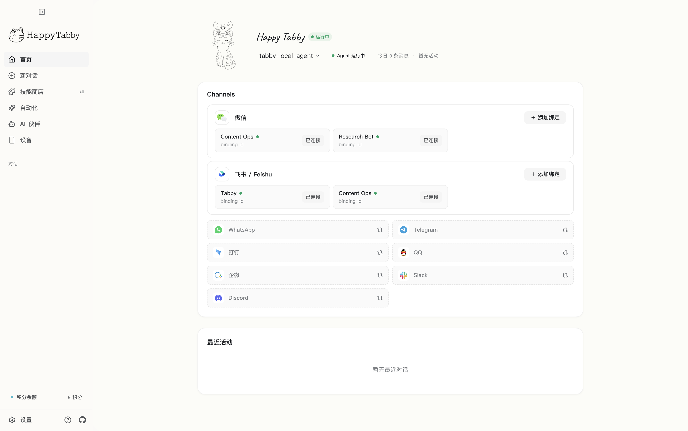

# Tabby

Tabby는 로컬 AI 파트너를 실행하고, 채팅 채널에 연결하며, 디바이스 작업 흐름을 하나의 앱에서 제어하기 위한 데스크톱 우선 AI 워크스페이스입니다.

<p align="center">
  <a href="README.md">English</a> |
  <a href="README.zh-CN.md">简体中文</a> |
  <a href="README.ja.md">日本語</a> |
  한국어
</p>

<p align="center">
  
</p>

Tabby는 실용적인 로컬 제어 평면이 필요한 개인과 소규모 팀을 위해 만들어졌습니다. AI 파트너를 만들고, 채팅 채널을 연결하고, 원하는 모델 제공자를 사용하며, 실행 상태를 자신의 컴퓨터에 보관할 수 있습니다.

## 다운로드

현재 공개 릴리스는 GitHub Releases에서 받을 수 있습니다.

- macOS Apple Silicon: [tabby-0.3.0-arm64.dmg](../../releases/download/v0.3.0/tabby-0.3.0-arm64.dmg)
- 릴리스 페이지: [Tabby 0.3.0](../../releases/tag/v0.3.0)

현재 릴리스에는 Intel macOS 및 Windows 패키지가 포함되어 있지 않습니다.

## Tabby로 할 수 있는 일

Tabby는 다음 작업을 위한 로컬 데스크톱 환경을 제공합니다.

- AI 파트너 생성 및 관리
- WeChat, Feishu, Slack, Discord 같은 채팅 채널에 AI 파트너 연결
- 데스크톱 앱에서 OpenClaw 기반 로컬 런타임 서비스 실행
- OAuth 및 bring-your-own-key 흐름을 포함한 모델 제공자 관리
- 스킬과 전문가 템플릿 설치 및 사용
- Android 디바이스 제어와 실시간 미러링 보기
- 예약 작업과 자동화 작업 실행

## 주요 기능

### 로컬 우선 데스크톱 런타임

Tabby는 controller, Web UI, OpenClaw 런타임을 데스크톱 앱에서 실행합니다. 사용자 설정과 런타임 상태는 로컬에 저장되므로 데이터와 자동화 흐름을 직접 제어할 수 있습니다.

### AI 파트너와 전문가

역할별 커스텀 AI 파트너를 만들고, 전문가 템플릿을 설치하며, 구조화된 워크스페이스 파일로 각 파트너에게 명확한 정체성과 작업 맥락을 부여할 수 있습니다.

### 채팅 채널 통합

이미 사용하는 IM 도구에 AI 파트너를 연결할 수 있습니다. Tabby는 채널 설정과 bot 바인딩 흐름을 제공하므로 각 채널을 적절한 AI 파트너로 라우팅할 수 있습니다.

### 디바이스 제어

Tabby는 Android 디바이스 제어와 실시간 미러링을 지원합니다. 디바이스를 연결하고, 실시간 화면을 보고, 작업을 전달하며, 데스크톱 대시보드에서 작업 기록을 확인할 수 있습니다.

### 스킬과 자동화

스킬을 설치하고, 런타임 설정을 동기화하며, 반복 자동화 작업을 예약할 수 있습니다. Tabby는 일회성 채팅 명령을 반복 가능한 Agent 작업 흐름으로 발전시키도록 설계되었습니다.

## 시스템 요구 사항

- macOS 12 이상
- 현재 `arm64` 릴리스에는 Apple Silicon Mac 필요
- 로컬 개발에는 pnpm 10+ 및 Node.js 22+ 필요

## 설치

1. 릴리스 페이지에서 `tabby-0.3.0-arm64.dmg`를 다운로드합니다.
2. DMG를 엽니다.
3. `Tabby.app`을 Applications로 드래그합니다.
4. Applications에서 Tabby를 실행합니다.

macOS 패키지는 Developer ID로 서명되었고, Apple notarization을 통과했으며, 릴리스 전에 stapler 티켓이 적용되었습니다.

## 개발

의존성을 설치합니다.

```bash
pnpm install
```

로컬 데스크톱 스택을 시작합니다.

```bash
pnpm dev start
```

로컬 데스크톱 스택을 중지합니다.

```bash
pnpm dev stop
```

일반 검사를 실행합니다.

```bash
pnpm typecheck
pnpm lint
pnpm test
```

macOS Apple Silicon production 패키지를 빌드합니다.

```bash
pnpm dist:mac:production:arm64
```

## 리포지토리 구조

```text
apps/
  controller/   로컬 제어 평면 및 HTTP API
  desktop/      Electron 데스크톱 셸과 패키징 런타임
  web/          React 대시보드
packages/
  shared/       공유 schema와 타입
  slimclaw/     OpenClaw 런타임 패키징 계약
tests/          통합 및 회귀 테스트
specs/          제품, 런타임, 아키텍처 노트
```

## 릴리스 노트

최신 릴리스 노트는 [GitHub Releases](../../releases) 페이지에서 확인하세요.

## 감사의 말

이 리포지토리는 Nexu 프로젝트의 기초 작업을 바탕으로 만들어졌습니다. Tabby의 기반이 된 작업을 제공한 Nexu에 감사드립니다.

## 라이선스

이 프로젝트는 [MIT License](LICENSE)에 따라 배포됩니다.
